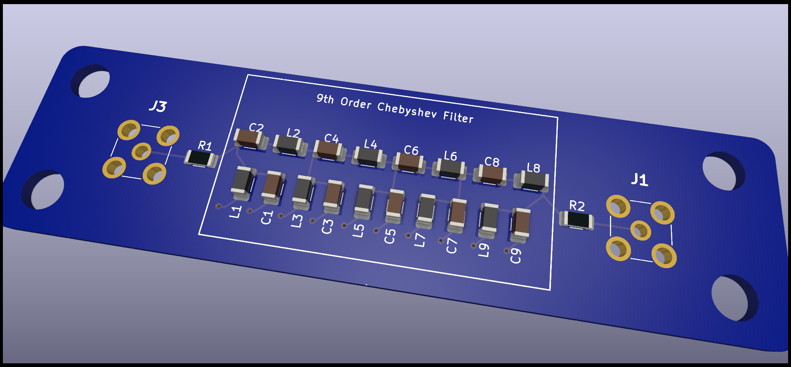
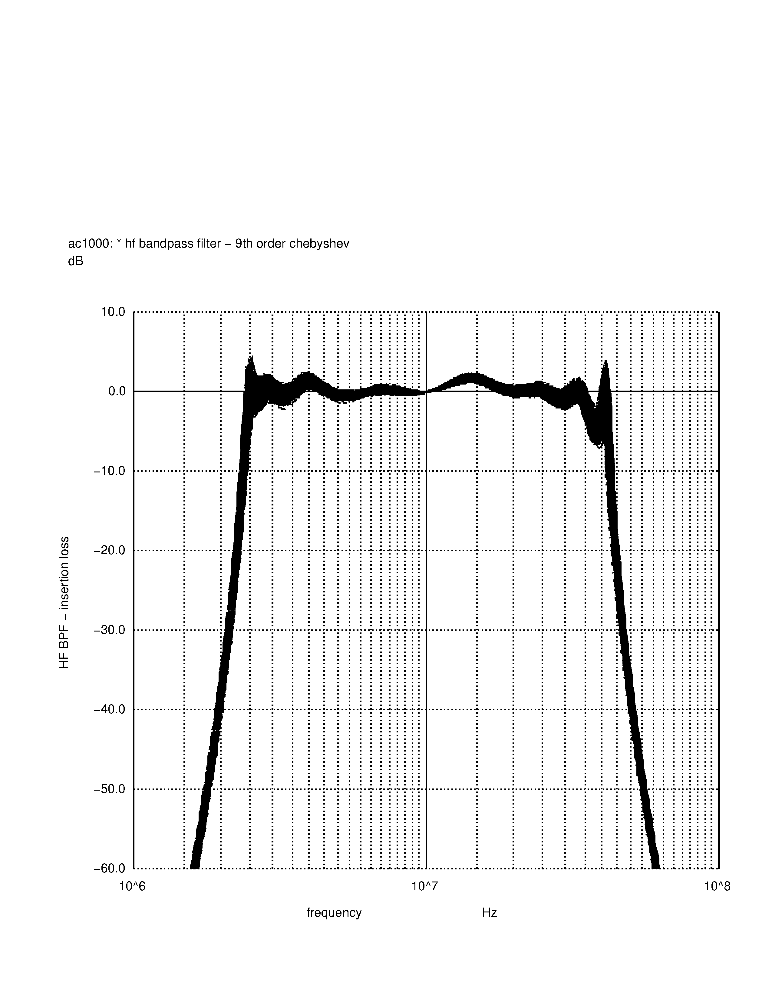
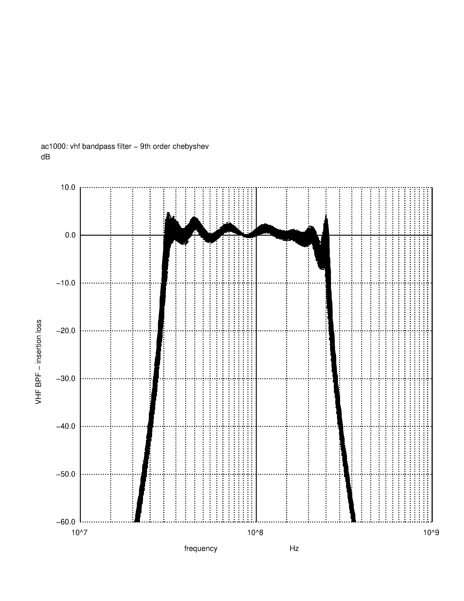
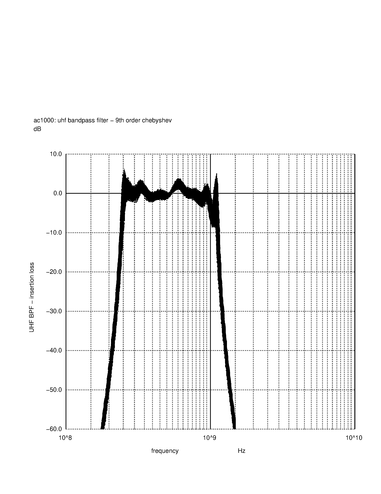
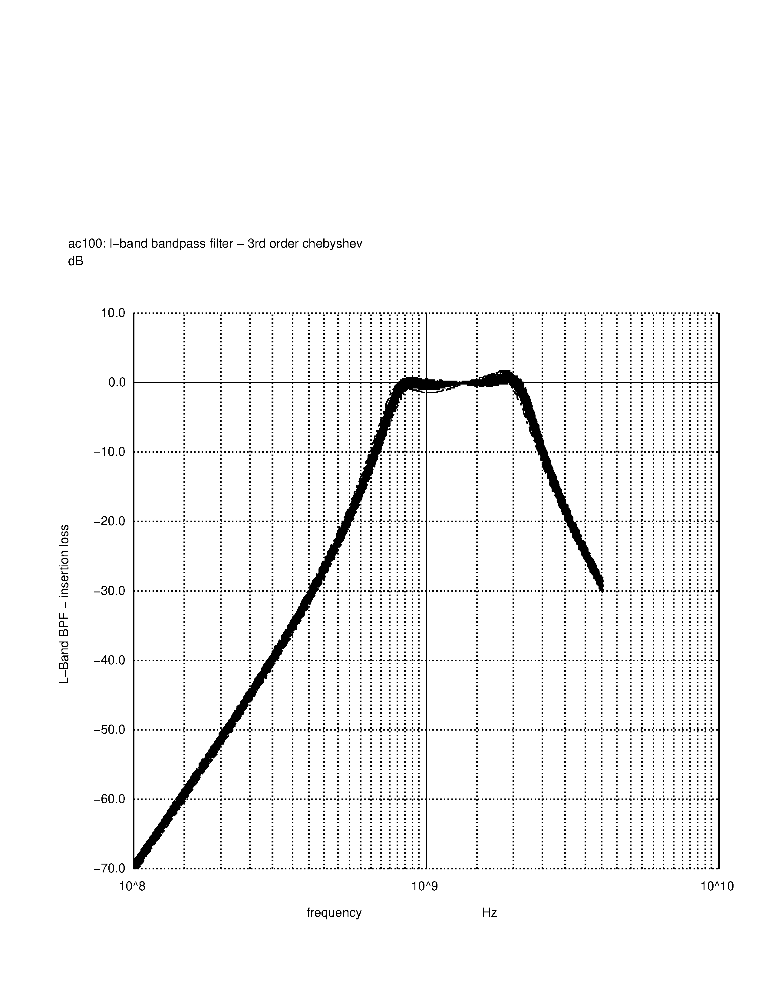

# KiCad design of a bandpass filter circuit board

This is an open source schemaatic and board layout for a 9th order chebyshev
filter. The filter was designed on the awesome [filter design tool website.](https://markimicrowave.com/technical-resources/tools/lc-filter-design-tool)

The schematic in this project is for a filter for the UHF band from 240 MHz to 1.2 GHz.

In the [models folder](./models) are a number of different filters that all have the same
shunt first topology, but pass different bands.

The boards that were printed can just be populated with the appropriate L's and C's to put
it into the desired band. The SPICE models included in the [models folder](./models) run 1000
different runs with all of the components varying within the 5% tolerance specified to form a
family of curves that form an envelope of the filter response.

There is an [HF bandpass filter design](./models/hf_filter_9th.spice) from 2.5 MHz to 30 MHz:

There is a [VHF bandpass filter design](./models/vhf_filter_9th.spice) from 30 MHz to 240 MHz:

There is the [UHF bandpass filter design](./models/uhf_filter_9th.spice) that is in the schematic (240 to 1100 MHz):

And there is an [L-Band bandpass filter design](./models/lband_bpf_3rd.spice) from 1000 to 1900 MHz:

I ordered 5 of these boards from [JLCPCB](https://jlcpcb.com). It was a very simple
process. I simply took the contents of the [gerbers folder](./gerbers), zipped
them up and uploaded the zipfile, and for $40 USD (including shipping), and about
2 weeks, I have a set of boards.

Once I have built one of these boards and tested it, I will post the results up here. I am
interested to see how the board parasitics will affect the frequency response of these
boards. I am expecting that the UHF and L-Band circuits will see some noticable deviations from
the spice model filter response. However, the FR4 PCB is supposed to be good for designs all the
way out to 6 GHz, so maybe there won't need to be any adjustments.
